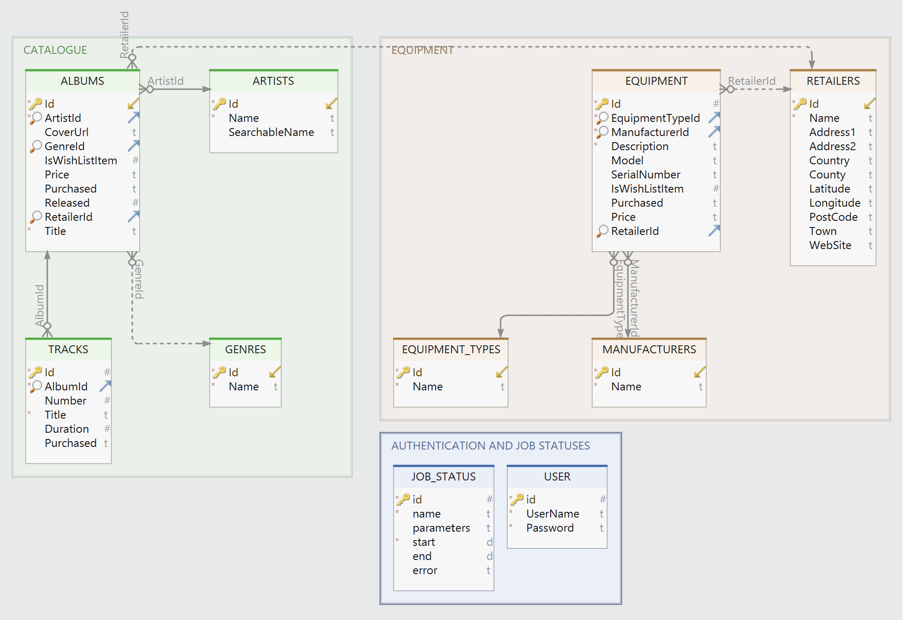

# MusicCatalogue

[](https://github.com/davewalker5/MusicCatalogue/actions)
[](https://github.com/davewalker5/MusicCatalogue/issues)
[](https://coveralls.io/github/davewalker5/MusicCatalogue?branch=main)
[](https://github.com/davewalker5/MusicCatalogue/releases)
[](https://github.com/davewalker5/MusicCatalogue/blob/master/LICENSE)
[](https://github.com/davewalker5/MusicCatalogue/)
[](https://github.com/davewalker5/MusicCatalogue/)
[](https://github.com/davewalker5/MusicCatalogue/)

## Overview

- To be completed once the web service and GUI have been implemented

## The Console Lookup Tool

- The application provides a simple command line interface for looking up albums one at a time
- The results are stored in a local SQLite database and subsequent searches for the same album return results from there rather than by querying the external APIs (see below)
- The following command line arguments are required:
  - Artist name
  - Album title
- Both should be enclosed in double-quotes
- For example:

```bash
MusicCatalogue.LookupTool "John Coltrane" "Blue Train"
```

- The output lists the album details and the number, title and duration of each track:


## Web Service

- The REST Web Service implements endpoints for
  - Retrieving artist details from the local database
  - Retrieving album and track details from the local database
  - Looking up albums via the external APIs (see below)
- The external lookup uses the "album lookup" algorithm described below

## GUI

- Under development

## Application Configuration File

- The console application and web service use a common configuration file format, described in this section

### General Settings and Database Connection String

- The appsettings.json file in the console application project contains the following keys for controlling the application:

| Section             | Key              | Purpose                                                                 |
| ------------------- | ---------------- | ----------------------------------------------------------------------- |
| ApplicationSettings | LogFile          | Path and name of the log file. If this is blank, no log file is created |
| ApplicationSettings | MinimumLogLevel  | Minimum message severity to log (Debug, Info, Warning or Error)         |
| ApplicationSettings | ApiEndpoints     | Set of endpoint definitions for external APIs                           |
| ApplicationSettings | ApiServiceKeys   | Set of API key definitions for external APIs                            |
| ConnectionStrings   | MusicCatalogueDB | SQLite connection string for the database                               |

### External API Configuration

- The lookup tool and web service include integration with the TheAudioDB public API for artist, album and track details lookup:

[TheAudioDB](https://rapidapi.com/theaudiodb/api/theaudiodb)

- To use the integration, a RapidAPI subscription is needed, as this includes an API key needed to acces the APIs
- Signup is free, but daily free usage is restricted with a nominal charge being made for requests above the free limit
- The integration is configured via the following keys in the configuration file:

| Section             | Sub-Section    | Purpose                                                                                     |
| ------------------- | -------------- | ------------------------------------------------------------------------------------------- |
| ApplicationSettings | ApiEndpoints   | A list of endpoint definitions, each containing the endpoint type, service and endpoint URL |
| ApplicationSettings | ApiServiceKeys | A list of entries mapping each service to the API key needed to access that service         |

#### ApiEndpoint Definitions

- An example API endpoint definition is shown below:

```json
{
  "EndpointType": "Albums",
  "Service": "TheAudioDB",
  "Url": "https://theaudiodb.p.rapidapi.com/searchalbum.php"
}
```

- Possible values for the endpoint type are:

| Type   | Description                                                                               |
| ------ | ----------------------------------------------------------------------------------------- |
| Albums | Endpoint used to retrieve album details given an artist name and album title              |
| Tracks | Endpoint used to retrieve track details given an album ID returned by the albums endpoint |

- Currently, only the TheAudioDB APIs are supported

#### ApiServiceKey Definitions

- An example key definition for a service is shown below:

```json
{
  "Service": "TheAudioDB",
  "Key": "put-your-RapidPI-key-here"
}
```

## Album Lookup

- The local SQLite database is searched preferentially for album details
- The external APIs are only used if an artist and/or album aren't found locally
- Details returned by the external APIs are stored in the local database provided the returned data is complete:
  - The artist is found
  - The album is found
  - The album has at least one track associated with it
- Consequently, subsequent searches with the same criteria will return data from the local database, not the APIs
- Artist names, album titles and track names are stored in title case
- Searches convert the search criteria to title case when looking details up in the database

## SQLite Database

### Database Schema



- Note that the "Duration" field on the TRACKS table denotes the track duration in ms

### Database Management

- The application uses Entity Framework Core and initial creation and management of the database is achieved using EF Core database migrations
- To create the database for the first time, first install the .NET Core SDK and then install the "dotnet ef" tool:

```bash
dotnet tool install --global dotnet-ef
```

- Update the database path in the "appsettings.json" file in the terminal application project to point to the required database location
- Build the solution
- Open a terminal window and change to the MusicCatalogue.Data project
- Run the following command, making sure to use the path separator appropriate for your OS:

```bash
dotnet ef database update -s ../MusicCatalogue.LookupTool/MusicCatalogue.LookupTool.csproj
```

- If the database doesn't exist, it will create it
- It will then bring the database up to date by applying all pending migrations

## Authors

- **Dave Walker** - _Initial work_ - [LinkedIn](https://www.linkedin.com/in/davewalker5/)

## Feedback

To file issues or suggestions, please use the [Issues](https://github.com/davewalker5/MusicCatalogue/issues) page for this project on GitHub.

## License

This project is licensed under the MIT License - see the [LICENSE](LICENSE) file for details.
