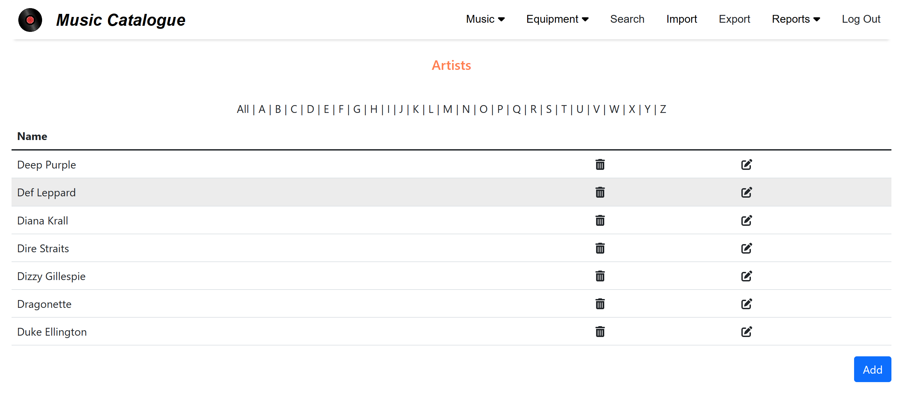
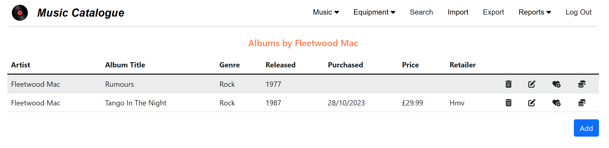
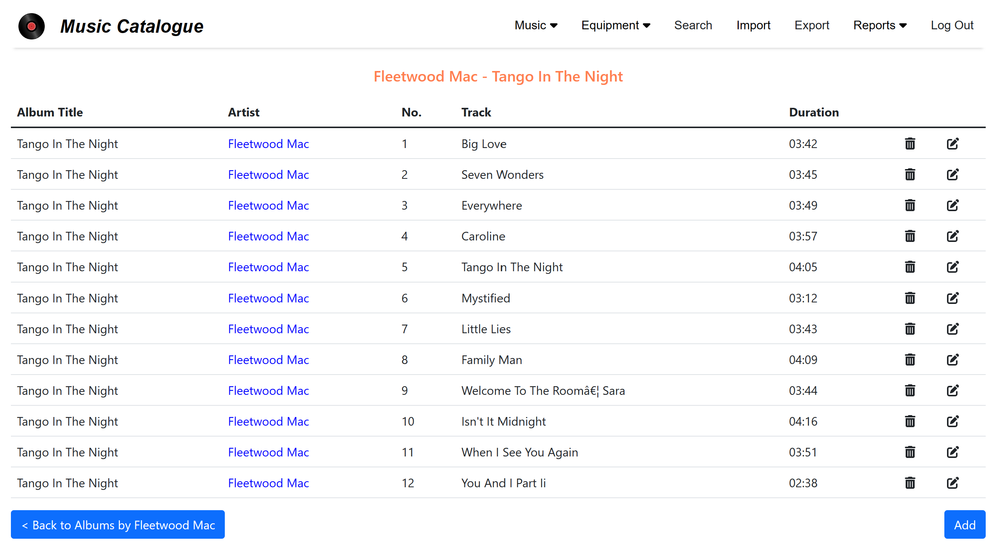
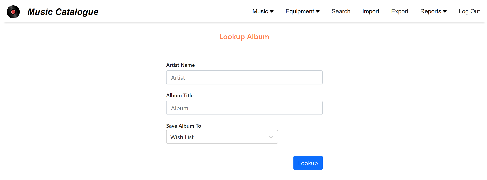
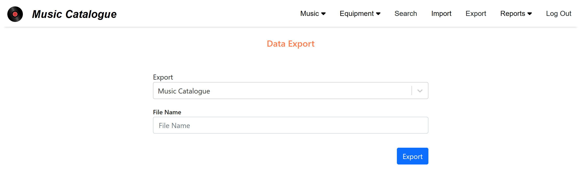
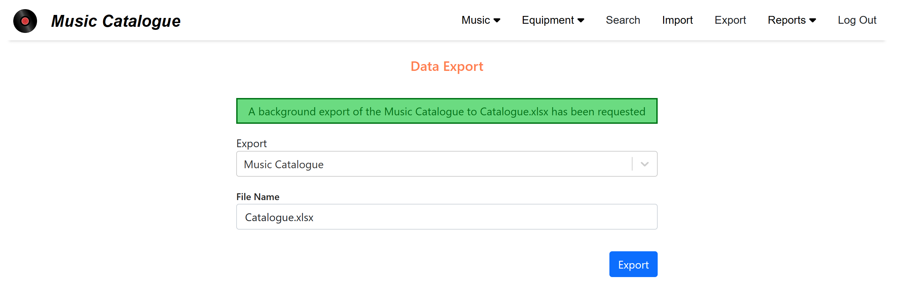
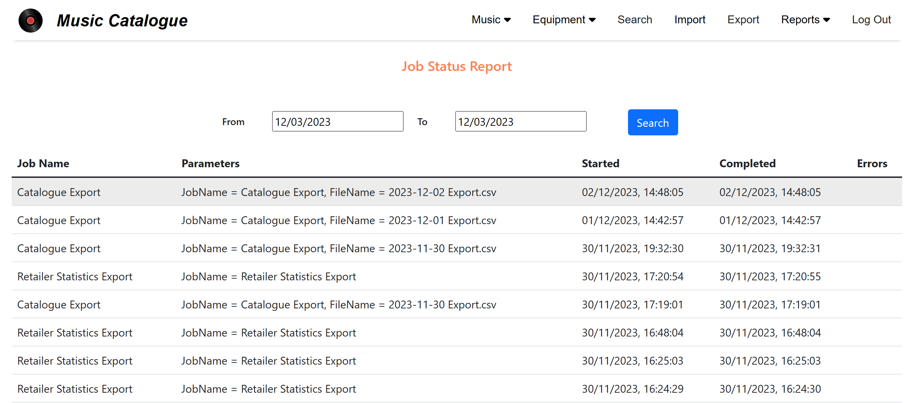

# MusicCatalogue

[](https://github.com/davewalker5/MusicCatalogue/actions)
[](https://github.com/davewalker5/MusicCatalogue/issues)
[](https://coveralls.io/github/davewalker5/MusicCatalogue?branch=main)
[](https://github.com/davewalker5/MusicCatalogue/releases)
[](https://github.com/davewalker5/MusicCatalogue/blob/master/LICENSE)
[](https://github.com/davewalker5/MusicCatalogue/)
[](https://github.com/davewalker5/MusicCatalogue/)
[](https://github.com/davewalker5/MusicCatalogue/)
[](https://github.com/davewalker5/MusicCatalogue/)

## Contents

- [Overview](#overview)
- [Console Lookup Tool](#the-console-lookup-tool)
- [UI](#gui)
- [Web Service](#web-service)
- [Application Configuration File](#application-configuration-file)
- [Album Lookup](#album-lookup)
- [SQLite Database](#sqlite-database)

## Overview


- The Music Catalogue repository is intended to provide a catalogue for a private music collection
- It supports the following functions:
  - Music catalogue collection browser (artists, albums and tracks)
  - A "wish list" of albums with the ability to move albums between the main catalogue and the wish list at will
  - Album search
  - External API integration for looking up new albums
  - Data import from CSV format files
  - Data export as CSV or Excel workbooks
- It contains the following components:

| Component    | Language | Purpose                                                            |
| ------------ | -------- | ------------------------------------------------------------------ |
| Entities     | C#       | Catalogue entities (albums, artists, tracks)                       |
| Data         | C#       | Database context and migrations for a SQLite database              |
| Logic        | C#       | Business logic for browsing the data and external API integration  |
| Console Tool | C#       | Command line tool providing facilities based on the business logic |
| REST API     | C#       | Web API exposing the facilities provided by the business logic     |
| GUI          | React.js | Browser UI for catalogue browsing                                  |

- NuGet packages are available for the entities, data and logic
- Docker builds of the REST API and GUI are also available

[^ top](#musiccatalogue)

## The Console Lookup Tool

### Overview

- The console application provides a simple command line interface for:
  - Looking up albums one at a time, given an artist and album title
  - Importing data from CSV files
  - Exporting data to CSV files or Excel workbooks
- The album lookup facility uses the algorithm described under "Album Lookup", below
- Consequently, searching for an album that's not currently in the catalogue will add it to the local database
- The console application doesn't use the web service (see below) and can be used standalone

### Configuration

- The console application uses an "appsettings.json" file to hold configuration settings
- It's described in the "Application Configuration File" section, below

### Command Line Options

- The following command line arguments are supported:

| Option   | Short Name | Required Values                  | Comments                                    |
| -------- | ---------- | -------------------------------- | ------------------------------------------- |
| --lookup | -l         | Artist name, album title, target | Performs an album lookup                    |
| --import | -i         | CSV file path                    | Import data from the specified CSV file     |
| --export | -e         | File path                        | Export the collection to the specified file |

- For album lookups
  - It is recommended that the artist name and album title are both double-quoted
  - This is mandatory if either contains spaces
  - The target determines whether the album is tagged as being in the wish list or the main catalogue:

| Value     | Target                                 |
| --------- | -------------------------------------- |
| wishlist  | Store new albums in the wish list      |
| catalogue | Store new albums in the main catalogue |

- For data exports, the exported format is based on the file extension for the supplied file path:

| Extension | Exported format |
| --------- | --------------- |
| xlsx      | Excel workbook  |
| csv       | CSV file        |

### CSV File Format

- The first row in the CSV file is expected to contain headers and is ignored
- Durations should be specified in MM:SS format, e.g. "03:10" for 3 minutes and 10 seconds
- The following is an example, illustrating the format for the headers and for the rows containing data:

```
Artist,Album,Genre,Released,Cover Url,Track Number,Track,Duration,Wish List,Purchase Date,Price,Retailer
George Harrison,All Things Must Pass,Rock & Roll,1970,https://www.theaudiodb.com/images/media/album/thumb/all-things-must-pass-4f09954aa6370.jpg,1,I'd Have You Anytime,02:56,False,12/11/2023,59.07,Amazon
```

- Exports include all albums in both the main catalogue and the wish list

### Example - Album Lookup

- The following command will look-up the album "Blue Train" by John Coltrane
- In this example, if the album isn't stored locally and is looked up using the external APIs (see below) the results will be stored in the main cataloge

```bash
MusicCatalogue.LookupTool --lookup "John Coltrane" "Blue Train" catalogue
```

- The output lists the album details and the number, title and duration of each track:


[^ top](#musiccatalogue)

## GUI

### Overview

- The GUI is written using React.js
- It provides facilities to:
  - Browse the artists, albums and track lists in the collection
  - Perform album lookups, given an artist name and title
- The album lookup facility uses the algorithm described under "Album Lookup", below
- Consequently, searching for an album that's not currently in the catalogue will add it to the local database
- The GUI uses the web service (see below) to retrieve and lookup data

### Configuration

- The UI uses a simple "config.json" file containing the base URL for the Music Catalogue web service and locale settings used by the UI:

```json
{
  "api": {
    "baseUrl": "http://localhost:8098"
  },
  "region": {
    "locale": "en-GB",
    "currency": "GBP"
  }
}
```

### Login

- On browing to the application, the login dialog is displayed, prompting for a username and password
- This authenticates with the web service (see below), so a valid login in the local database is required
- Instructions on adding a user to the database are given in the "Database Users" section, below

### Browsing the Catalogue

#### Main Catalogue

- After logging in, the "Artists" page is displayed, listing the artists currently in the database
- This acts as the home page for the site and clicking on the "Artists" menu item or the site logo navigates back to it



- As the mouse pointer is moved up and down the table, the current row is highlighted
- Clicking on a row opens the album list for the artist shown in that row:



- As the mouse pointer is moved up and down the table, the current row is highlighted
- Clicking on the trash icon prompts for confirmation and, if confirmed, deletes the album shown in that row along with the associated tracks
- Clicking on the "heart" icon moves the album from the main catalogue to the wish list then refreshes the album list
- Clicking on the "money" icon opens a form allowing the purchase details to be set:


- Clicking anywhere else on a row opens the track list for the album shown in that row:



- Clicking on the artist name in any row in the track list or clicking on the "Back" button returns to the album list for that artist

#### The Wish List

- To view the wish list, click on the "Wish List" menu item
- A page identical in layout to the "Artists" page is displayed, but with a title indicating that it is the wish list
- The page operates in an identical manner to the "Artists" page and clicking on a row in the table navigates to the wish list for that artist:


- Clicking on a row drills into the album content, as per the "Artists" page
- Clicking on the trash icon prompts for confirmation and, if confirmed, deletes the album shown in that row along with the associated tracks
- Clicking on the vinyl record icon moves the album from the wish list to the main catalogue then refreshes the album list
- Clicking on the money icon opens the purchase details page and allows the price and a potential retailer to be set, but not the purchase date

### Album Lookup

- To search for an album, click on the "Search" menu bar item:



- Enter the artist name and album title and select the target directory (wish list or main catalogue) then click on "Lookup" to search for the album
- If the album is found, the track list for the album is displayed
- The album lookup facility uses the algorithm described under "Album Lookup", below
- Consequently, searching for an album that's not currently in the catalogue will add it to the local database

### Data Import

- This is scheduled for implementation in a future iteration of the UI

### Data Export

- To export the music catalogue, click on the "Export" menu bar item:



- Enter the file name, without a path, and click on the "Export" button to request an export
- A request is sent to the web service to perform an export of the catalogue in the background
- The "export" page is updated when the request has been sent:



- Once the export is complete, the file will appear in the folder indicated by the "CatalogueExportPath" configuration setting (see below)
- The exported format is based on the file extension for the supplied file path, as per the command-line tool (see above)

### Reports

#### Job Status Report

- To view a report on the status of background export jobs, click on the "Reports > Job Status" menu bar item:



- Use the date pickers to select the start and end dates for the report and click on the "Search" button to view the results
- Records are included from 00:00 on the start date up to and including 23:59 on the end date

[^ top](#musiccatalogue)

## Web Service

### Facilities

- The REST Web Service implements endpoints for
  - Authenticating registered users
  - Retrieving artist details from the local database
  - Retrieving album and track details from the local database
  - Looking up albums via the external APIs (see below)
  - Managing retailers and purchase details
- The external lookup uses the "album lookup" algorithm described under "Album Lookup", below
- Swagger documentation exposed at:

```
/swagger/index.html
```

- For full details of the service endpoints, it's recommended to build and run the service and review the documentation exposed at the above URL

### Configuration

- The web service uses an "appsettings.json" file to hold configuration settings
- It's described in the "Application Configuration File" section, below

### Authentication

- The service uses bearer token authentication, so clients should:
  - Use the /users/authenticate endpoint to get a token
  - Set the authorization header in subsequent requests:

```
Authorization: Bearer <token>
```

### Database Users

- To authenticate, users must have a record in the USERS table of the database associating a username with their hashed password
- The following is a code snippet for adding a user to the database:

```csharp
var userName = "SomeUser";
var password = "ThePassword";
var context = new MusicCatalogueDbContextFactory().CreateDbContext(Array.Empty<string>());
var factory = new MusicCatalogueFactory(context);
Task.Run(() => factory.Users.AddAsync(userName, password)).Wait();
```

[^ top](#musiccatalogue)

## Application Configuration File

- The console application and web service use a common configuration file format, described in this section
- The GUI has a much simpler configuration file that's described along with the UI, above

### General Settings and Database Connection String

- The appsettings.json file in the console application project contains the following keys for controlling the application:

| Section             | Key                 | Purpose                                                                 |
| ------------------- | ------------------- | ----------------------------------------------------------------------- |
| ApplicationSettings | LogFile             | Path and name of the log file. If this is blank, no log file is created |
| ApplicationSettings | MinimumLogLevel     | Minimum message severity to log (Debug, Info, Warning or Error)         |
| ApplicationSettings | CatalogueExportPath | Path to the folder where music catalogue exports are written            |
| ApplicationSettings | ApiEndpoints        | Set of endpoint definitions for external APIs                           |
| ApplicationSettings | ApiServiceKeys      | Set of API key definitions for external APIs                            |
| ConnectionStrings   | MusicCatalogueDB    | SQLite connection string for the database                               |

### External API Configuration

- The lookup tool and web service include integration with the TheAudioDB public API for artist, album and track details lookup:

[TheAudioDB](https://rapidapi.com/theaudiodb/api/theaudiodb)

- To use the integration, a RapidAPI subscription is needed, as this includes an API key needed to acces the APIs
- Signup is free, but daily free usage is restricted with a nominal charge being made for requests above the free limit
- The integration is configured via the following keys in the configuration file:

| Section             | Sub-Section    | Purpose                                                                                     |
| ------------------- | -------------- | ------------------------------------------------------------------------------------------- |
| ApplicationSettings | ApiEndpoints   | A list of endpoint definitions, each containing the endpoint type, service and endpoint URL |
| ApplicationSettings | ApiServiceKeys | A list of entries mapping each service to the API key needed to access that service         |

#### ApiEndpoint Definitions

- An example API endpoint definition is shown below:

```json
{
  "EndpointType": "Albums",
  "Service": "TheAudioDB",
  "Url": "https://theaudiodb.p.rapidapi.com/searchalbum.php"
}
```

- Possible values for the endpoint type are:

| Type   | Description                                                                               |
| ------ | ----------------------------------------------------------------------------------------- |
| Albums | Endpoint used to retrieve album details given an artist name and album title              |
| Tracks | Endpoint used to retrieve track details given an album ID returned by the albums endpoint |

- Currently, only the TheAudioDB APIs are supported

#### ApiServiceKey Definitions

- An example key definition for a service is shown below:

```json
{
  "Service": "TheAudioDB",
  "Key": "put-your-RapidPI-key-here"
}
```

- The "Key" can also specify an external text file in an alternative location containing a single line holding the API key
- This approach is used in the Docker image of the API, where the key file is mounted from the host, avoiding baking the API key into the image

[^ top](#musiccatalogue)

## Album Lookup

- The local SQLite database is searched preferentially for album details
- The external APIs are only used if an artist and/or album aren't found locally
- Details returned by the external APIs are stored in the local database provided the returned data is complete:
  - The artist is found
  - The album is found
  - The album has at least one track associated with it
- Consequently, subsequent searches with the same criteria will return data from the local database, not the APIs
- Artist names, album titles and track names are stored in title case
- Searches convert the search criteria to title case when looking details up in the database

[^ top](#musiccatalogue)

## SQLite Database

### Database Schema


- Note that the "Duration" field on the TRACKS table denotes the track duration in ms

### Database Management

- The application uses Entity Framework Core and initial creation and management of the database is achieved using EF Core database migrations
- To create the database for the first time, first install the .NET Core SDK and then install the "dotnet ef" tool:

```bash
dotnet tool install --global dotnet-ef
```

- Update the database path in the "appsettings.json" file in the terminal application project to point to the required database location
- Build the solution
- Open a terminal window and change to the MusicCatalogue.Data project
- Run the following command, making sure to use the path separator appropriate for your OS:

```bash
dotnet ef database update -s ../MusicCatalogue.LookupTool/MusicCatalogue.LookupTool.csproj
```

- If the database doesn't exist, it will create it
- It will then bring the database up to date by applying all pending migrations

[^ top](#musiccatalogue)

## Authors

- **Dave Walker** - _Initial work_ - [LinkedIn](https://www.linkedin.com/in/davewalker5/)

## Feedback

To file issues or suggestions, please use the [Issues](https://github.com/davewalker5/MusicCatalogue/issues) page for this project on GitHub.

## License

This project is licensed under the MIT License - see the [LICENSE](LICENSE) file for details.
